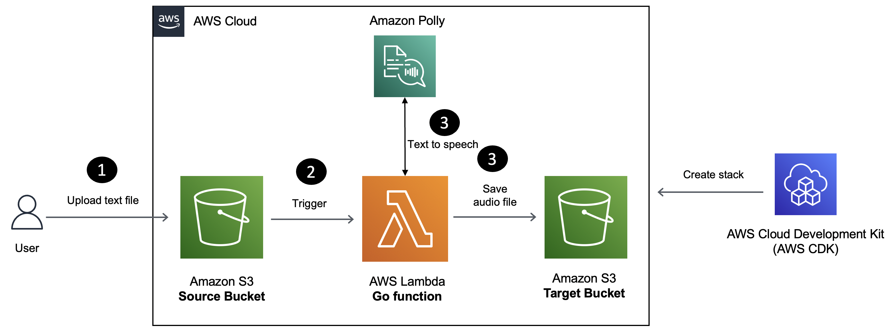

# Step-by-Step Guide to Building a Serverless Text to Speech Solution using Golang on AWS

In this blog post, you will learn how to build a Serverless text to speech conversion solution using [Amazon Polly](https://aws.amazon.com/polly/), [AWS Lambda](https://aws.amazon.com/lambda/) and the [Go](https://go.dev/) programming language. 

The Lambda function is written using the [aws-lambda-go](https://github.com/aws/aws-lambda-go) library and you will use the *Infrastructure-Is-Code* paradigm to deploy the solution with AWS CDK (thanks to the [Go bindings for AWS CDK](https://docs.aws.amazon.com/cdk/v2/guide/work-with-cdk-go.html))
